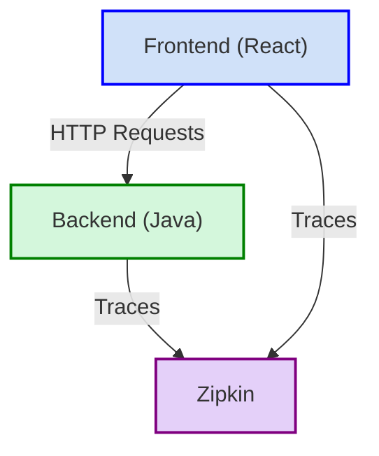

```mermaid
flowchart TB
    Frontend["Frontend (React)"] -->|HTTP Requests| Backend["Backend (Java)"]
    Backend -->|Traces| Zipkin["Zipkin"]
    Frontend -->|Traces| Zipkin

    style Frontend fill:#d0e1f9,stroke:#0000ff,stroke-width:2px
    style Backend fill:#d4f7dc,stroke:#008000,stroke-width:2px
    style Zipkin fill:#e4d0f9,stroke:#800080,stroke-width:2px
```